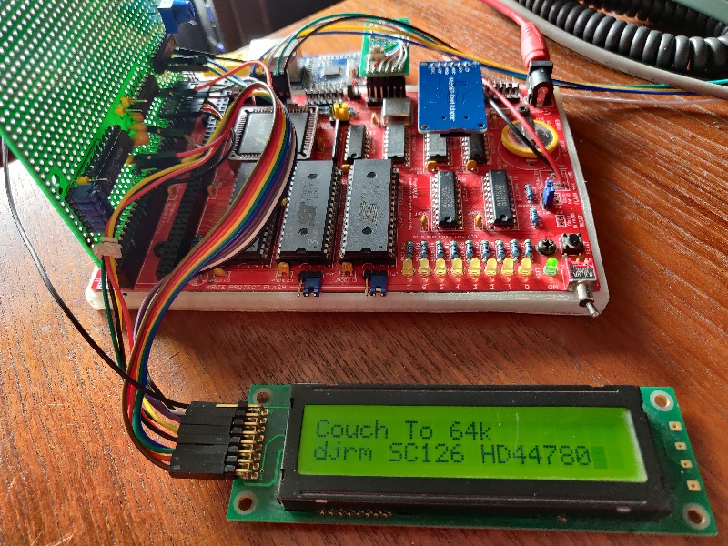

# Simple SC126 LCD console display

This is a very simple dumb terminal add-on for the SC126 ASC serial output device, it echoes characters sent to the serial port to a two line LCD.

The dumb terminal software is based on the Scott Baker VFD design though this one has additional ready state polling on all output commands, The Z80 display code is based on the couch-to-64k breadboard computer design.

The hardware is connected to a modified DTRONIXS Enhanced Prototype board from Tindie, the output port uses HCT688, HCT32 and an additional HC04 gate.

I found it neccessary to add additional I/O wait states to the RomWbw configuration to get stable operation with CP/Net network. without the wait states the standard configuration was mainly ok, normal SC126 Z180 clock of 18MHz is used.

The modified RomWbw shows a splash screen when initialised and then patches into the ASC output functions.

The eventual purpose is to make a simple standalone terminal using a PC keyboard and a new console device with something similar to this for the output - using an LCD with a bigger screen actually.



I modified the prototype card by cutting some tracks and adding the M1 and IOREQ signals as additional inputs to the HCT688, the address compare output is fed through an inverter to the LCD E input. The bus RD signal is inverted and fed to the LCD R/W input.

Initial testing was done with a stand alone test program using the couch to 64k HD44780 library and a simple wrapper to make a com file.

```
;hd44780te.z80
;Hello world using LCD libraries

;Constants
lcd_command equ $00     ;LCD command I/O port
lcd_data equ $01        ;LCD data I/O port
   
        org 100H
        
program_entry:    
    
    call lcd_initialise ;Setup LCD display
    
    ld hl, splash_message
    call lcd_send_asciiz
    
    ld de,$0001         ;Position cursor on second line
    call lcd_gotoxy
    
    call lcd_cursor_on  ;Turn the cursor on
    ret

splash_message:

    db "djrm SC126 HD44780",0    

;Libraries
;---------   
include "CharLCDLib.z80"
```
I used a simple Z80 assembler 'pasmo' to make the com file.

Changes to RomWbw are copied into the hbios and config directories here:
[Files](./hbios)

The changes to the prototype board I/O decoding used is shown here
[Decode i/o](./decode_io.jpg) It involved cutting some board tracks between pins ground and pins 1,2,3,4,5 on the HCT688 chip - it would have been easier to do before soldering the chip in place.

### Links
[Pasmo assembler](https://pasmo.speccy.org/pasmodoc.html)

[Couch to 64k](https://github.com/Bread80/Couch-To-64k---Breadboard-Z80-Computer)

[Scott Baker VFD](https://www.smbaker.com/z80-retrocomputing-13-rc2014-vfd-display-board)

[DTRINIXS ProroCardPlus](https://www.tindie.com/products/dtronixs/prototype-boardpcb-for-the-rc2014-bus/)